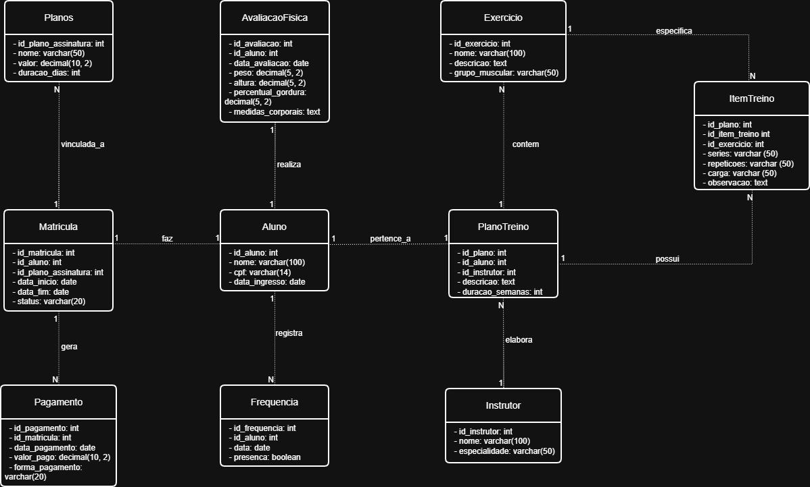

# 🏋️‍♂️ Sistema de Gestão de Academia

Este é um projeto de sistema de desktop completo para a gestão de academias, construído com Java. Ele permite o controle de alunos, planos, pagamentos, treinos e muito mais.

O sistema é dividido em três camadas principais:

*   **Interface Gráfica (Frontend)**: As telas, botões e menus que o usuário vê e utiliza, desenvolvidos com **Java Swing**.
*   **API (Backend)**: A lógica de negócios que opera nos bastidores, processando dados e executando as regras do sistema, construída com **Spring Boot**.
*   **Banco de Dados (Database)**: O local onde todas as informações são armazenadas com segurança, utilizando **MySQL**.

---

## 📋 Índice

- [Funcionalidades Principais](#-funcionalidades-principais)
- [Tecnologias Utilizadas](#-tecnologias-utilizadas)
- [Arquitetura e Modelagem](#-arquitetura-e-modelagem)
- [Começando (Instalação e Configuração)](#-começando)
- [Como Executar](#-como-executar)
- [Solução de Problemas](#-solução-de-problemas)
- [Autores](#-autores)

---

## ✨ Funcionalidades Principais

O sistema oferece um controle completo para a administração de uma academia:

- **Gestão de Alunos e Instrutores**: Cadastro e gerenciamento de informações.
- **Controle de Planos e Matrículas**: Criação e associação de planos aos alunos.
- **Registro de Pagamentos**: Controle financeiro e status de inadimplência.
- **Criação de Planos de Treino**: Elaboração de treinos personalizados.
- **Histórico de Avaliações Físicas**: Acompanhamento da evolução dos alunos.
- **Controle de Frequência**: Registro de check-ins diários.

---

## 🛠️ Tecnologias Utilizadas

Este projeto foi construído com as seguintes tecnologias:

- **Linguagem**: Java
- **Framework**: Spring Boot
- **Banco de Dados**: MySQL
- **Interface Gráfica**: Java Swing
- **Gerenciador de Build**: Gradle

---

## 🏗️ Arquitetura e Modelagem

Abaixo estão os diagramas que representam a estrutura do sistema.

### Diagrama Conceitual


### Diagrama de Classes


---

## 🚀 Começando

Siga estes passos para configurar e executar o projeto em sua máquina local.

### 1. Pré-requisitos

Antes de começar, garanta que você tenha as seguintes ferramentas instaladas:

- **Java (JDK) 21**: Essencial para executar o código do projeto.
  - **Importante**: Configure as variáveis de ambiente `JAVA_HOME` e `Path`.
- **MySQL Server e MySQL Workbench**: Para o banco de dados e sua ferramenta de gerenciamento.
- **Visual Studio Code**: Editor de código recomendado.
  - Instale as extensões: `Extension Pack for Java` e `Spring Boot Extension Pack`.
- **Git**: (Opcional, mas recomendado para controle de versão).

### 2. Configuração do Ambiente

- **Clone o Repositório**:
  ```bash
  git clone https://github.com/Shizuo0/GymManagement.git
  ```
  (Se você baixou o `.zip`, apenas extraia o arquivo em uma pasta).

- **Abra o Projeto**:
  1. Abra o **Visual Studio Code**.
  2. Vá em `File > Open Folder` e selecione a pasta do projeto.

- **Aguarde o Gradle**:
  Ao abrir, o Gradle começará a baixar as dependências necessárias. Aguarde a conclusão do processo.

### 3. Configuração do Banco de Dados

- **Inicie o MySQL Workbench**: Conecte-se à sua instância local.

- **Crie o Banco e as Tabelas**:
  Na tela de query, cole e execute o script SQL abaixo para criar o banco de dados (`sistema_gestao_academia`) e suas tabelas:

  ```sql
  DROP DATABASE IF EXISTS sistema_gestao_academia;
  CREATE DATABASE sistema_gestao_academia;
  USE sistema_gestao_academia;

  CREATE TABLE Planos (
      id_plano_assinatura INT PRIMARY KEY AUTO_INCREMENT,
      nome VARCHAR(50) NOT NULL,
      valor DECIMAL(10, 2) NOT NULL,
      descricao VARCHAR(50),
      duracao_meses INT NOT NULL
  );

  CREATE TABLE Alunos (
      id_aluno INT PRIMARY KEY AUTO_INCREMENT,
      nome VARCHAR(100) NOT NULL,
      cpf VARCHAR(14) NOT NULL UNIQUE,
      data_ingresso DATE
  );

  CREATE TABLE Instrutores (
      id_instrutor INT PRIMARY KEY AUTO_INCREMENT,
      nome VARCHAR(100) NOT NULL,
      especialidade VARCHAR(50)
  );

  CREATE TABLE Matriculas (
      id_matricula INT PRIMARY KEY AUTO_INCREMENT,
      id_aluno INT NOT NULL,
      id_plano_assinatura INT NOT NULL,
      data_inicio DATE NOT NULL,
      data_fim DATE NOT NULL,
      status VARCHAR(20) NOT NULL,
      FOREIGN KEY (id_aluno) REFERENCES Alunos (id_aluno),
      FOREIGN KEY (id_plano_assinatura) REFERENCES Planos (id_plano_assinatura)
  );

  CREATE TABLE Pagamentos (
      id_pagamento INT PRIMARY KEY AUTO_INCREMENT,
      id_matricula INT NOT NULL,
      data_pagamento DATE NOT NULL,
      valor_pago DECIMAL(10, 2) NOT NULL,
      forma_pagamento VARCHAR(20),
      FOREIGN KEY (id_matricula) REFERENCES Matriculas (id_matricula)
  );

  CREATE TABLE AvaliacoesFisicas (
      id_avaliacao INT PRIMARY KEY AUTO_INCREMENT,
      id_aluno INT NOT NULL,
      id_instrutor INT NOT NULL,
      data_avaliacao DATE NOT NULL,
      peso DECIMAL(5,2),
      altura DECIMAL(5, 2),
      percentual_gordura DECIMAL(5, 2),
      medidas_corporais TEXT,
      FOREIGN KEY (id_aluno) REFERENCES Alunos (id_aluno),
      FOREIGN KEY (id_instrutor) REFERENCES Instrutores (id_instrutor)
  );

  CREATE TABLE Frequencia (
      id_frequencia INT PRIMARY KEY AUTO_INCREMENT,
      id_aluno INT NOT NULL,
      data DATE NOT NULL,
      presenca BOOLEAN DEFAULT FALSE,
      FOREIGN KEY (id_aluno) REFERENCES Alunos (id_aluno)
  );

  CREATE TABLE PlanosTreino (
      id_plano INT PRIMARY KEY AUTO_INCREMENT,
      id_aluno INT NOT NULL,
      id_instrutor INT NOT NULL,
      descricao TEXT,
      duracao_semanas INT,
      FOREIGN KEY (id_aluno) REFERENCES Alunos (id_aluno),
      FOREIGN KEY (id_instrutor) REFERENCES Instrutores (id_instrutor)
  );

  CREATE TABLE Exercicios (
      id_exercicio INT PRIMARY KEY AUTO_INCREMENT,
      nome VARCHAR(100) NOT NULL,
      grupo_muscular VARCHAR(50),
      descricao VARCHAR(50)
  );

  CREATE TABLE ItensTreino (
      id_item_treino INT PRIMARY KEY AUTO_INCREMENT,
      id_plano INT NOT NULL,
      id_exercicio INT NOT NULL,
      series VARCHAR(50),
      repeticoes VARCHAR(50),
      carga VARCHAR(50),
      observacoes TEXT,
      FOREIGN KEY (id_plano) REFERENCES PlanosTreino (id_plano),
      FOREIGN KEY (id_exercicio) REFERENCES Exercicios (id_exercicio)
  );
  ```

- **Configure a Conexão**:
  1. No VS Code, encontre e abra o arquivo `.env` na raiz do projeto.
  2. Verifique se a linha `DB_PASSWORD` corresponde à senha `root` que você criou ao instalar o MySQL.
     ```properties
     DB_PASSWORD=sua_senha_aqui
     ```
  3. Salve o arquivo (`Ctrl + S`).

---

## 🏁 Como Executar

Com tudo configurado, para iniciar a aplicação:

1.  Abra um novo terminal no VS Code (`Terminal > New Terminal`).
2.  Digite o seguinte comando e pressione `Enter`:
    ```bash
    .\gradlew runUI
    ```
Aguarde a compilação e a janela do sistema será aberta.

**Para parar o sistema**:
- Feche a janela do programa.
- No terminal do VS Code, pressione `Ctrl + C`.

---

## ❓ Solução de Problemas

- **Erro: "Port 5000 is already in use"**
  - **Problema**: Outro programa está usando a porta 5000.
  - **Solução**: Abra o arquivo `.env` e mude a linha `SERVER_PORT=5000` para um número diferente, como `SERVER_PORT=5001`.

- **Erro: "Table '...'.doesn't exist"**
  - **Problema**: As tabelas não foram criadas corretamente.
  - **Solução**: 1. Verifique se você executou o script SQL completo. 2. Verifique se a linha `JPA_DDL_AUTO=update` existe no seu arquivo `.env`.

- **Erro: "Access denied for user 'root'..."**
  - **Problema**: A senha no arquivo `.env` está incorreta.
  - **Solução**: Revise a configuração e garanta que `DB_PASSWORD` no arquivo `.env` é a mesma senha que você usa no MySQL Workbench.

---

## 👨‍💻 Autores

- Gigio Moura Melo
- Paulo Shizuo Vasconcelos Tatibana
